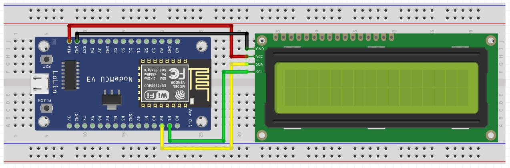
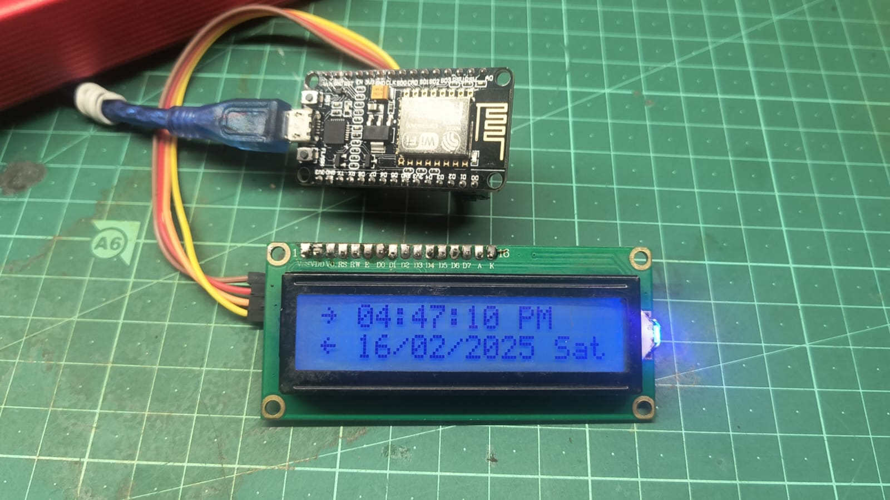

# ESP8266 NTP Clock with 16x2 I2C LCD Display

## Overview
This project uses an **ESP8266 NodeMCU** to create a **12-hour format NTP clock** with **AM/PM**, **date**, and **day of the week**, displayed on a **16x2 I2C LCD**. The clock synchronizes time via the **NTP (Network Time Protocol)** to ensure accuracy.

## Features
- Displays real-time clock (12-hour format) with **AM/PM** indicator.
- Shows current **date** and **weekday**.
- Synchronizes time via **NTP server**.
- Uses **I2C 16x2 LCD** for display.
- **Auto-updates** time based on **Indian Standard Time (IST, UTC+5:30)**.

## Components Required

| Component              | Quantity |
| ---------------------- | -------- |
| ESP8266 NodeMCU        | 1        |
| 16x2 I2C LCD           | 1        |
| Jumper Wires           | As needed|

## Circuit Diagram

## Connections

| ESP8266 Pin           | LCD Pin       |
| --------------------- | ------------- |
| 3.3V                  | VCC           |
| GND                   | GND           |
| D2 (GPIO4)            | SDA           |
| D1 (GPIO5)            | SCL           |

## Installation & Setup

### 1. Install Required Libraries
Make sure you have the following libraries installed in **Arduino IDE**:

- **LiquidCrystal_I2C** (Download)
- **NTPClient** (Download)
- **ESP8266WiFi** (Comes with ESP8266 board package)

### 2. Upload the Code
1. Open the provided code in **Arduino IDE**.
2. Replace `your_SSID` and `your_PASSWORD` with your WiFi credentials.
3. Select **ESP8266 NodeMCU** as the board.
4. Upload the code and open the **Serial Monitor** (115200 baud rate).

## How the Code Works
- **WiFi Connection:** Connects ESP8266 to a WiFi network.
- **NTP Synchronization:** Fetches time from an NTP server (pool.ntp.org).
- **Time Conversion:** Converts 24-hour format to 12-hour format with AM/PM.
- **Display Update:** Updates the LCD every second with time, date, and weekday.

## Clock Demo
 

## License
This project is **open-source** and free to use.

## Contributions
Feel free to fork this project and contribute!

## Troubleshooting

**LCD not displaying anything?**
- Run the **I2C Scanner** to find the correct I2C address and update it in the code.
- Ensure **SDA** and **SCL** pins are connected properly.

**WiFi not connecting?**
- Double-check your **WiFi SSID** and **Password** in the code.
- Make sure your **router** is working correctly.

For further assistance, feel free to ask! 🚀

## 🔗 Connect with Me
[🌐 Website](https://electroiot.in)  
[✉️ Email](mailto:electroiot@hotmail.com)  
[📺 YouTube](https://www.youtube.com/@ElectroIoT-IN)  
[🔬 Hackster.io](https://www.hackster.io/Manoranjan2050)  
[📖 Instructables](https://www.instructables.com/member/ElectroIoTIN)  

