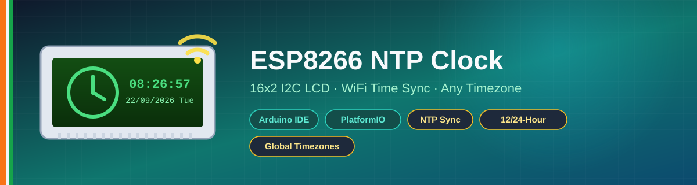
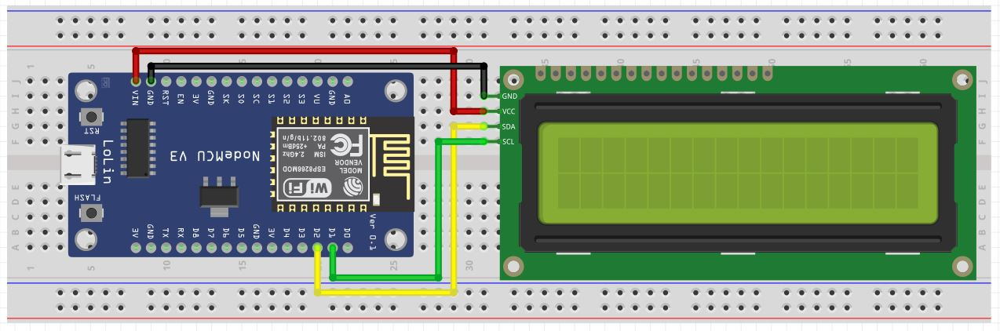
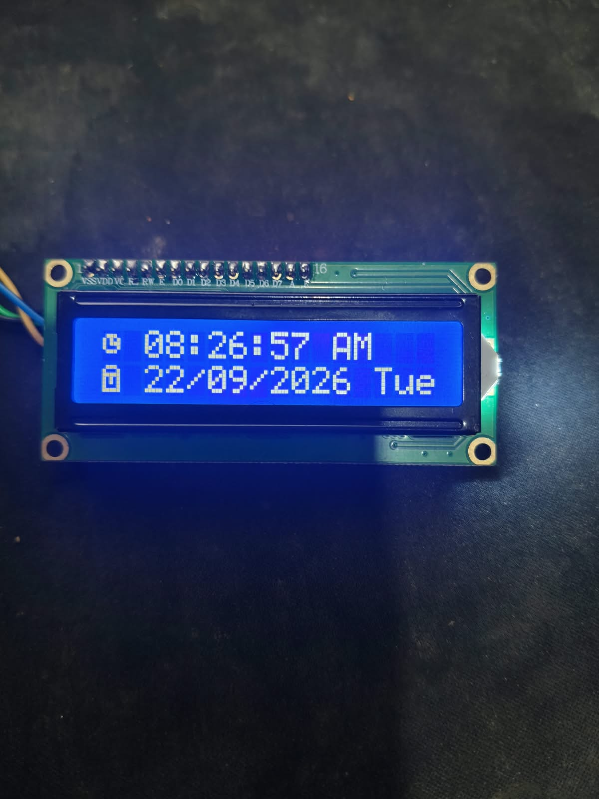
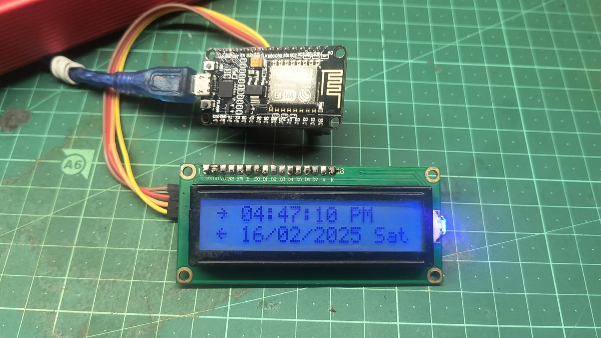

<p align="center">
  
</p>

## Overview
This project uses an **ESP8266** (NodeMCU or Wemos D1 Mini) to build a **WiFi NTP clock** with **12/24-hour format**, **date**, and **day of the week**, displayed on a **16x2 I2C LCD**. Time is synced automatically over **NTP**, with configurable **timezone** so it works anywhere in the world, not just India.

## Features
- Real-time clock synced via **NTP**, with automatic reconnect if WiFi drops.
- **12-hour (AM/PM) or 24-hour** display — switch with one line in `config.h`.
- **Configurable timezone** — pick any region's UTC offset, not just IST.
- Correct calendar math (leap years, month lengths) via the ESP8266 core's `configTime()`/`localtime()` — no date drift.
- Custom clock/calendar icons on the LCD.
- Works with the **Arduino IDE** (recommended for everyone) or **PlatformIO** (optional, for those who prefer it).

## Components Required

| Component              | Quantity |
| ---------------------- | -------- |
| ESP8266 NodeMCU / Wemos D1 Mini | 1 |
| 16x2 I2C LCD           | 1        |
| Jumper Wires           | As needed|

## Circuit Diagram


## Connections

| ESP8266 Pin        | LCD Pin |
| ------------------- | ------- |
| 3.3V                 | VCC     |
| GND                  | GND     |
| D6 (GPIO12)          | SDA     |
| D5 (GPIO14)          | SCL     |

> These pins are configurable in [`include/config.h`](include/config.h) (`SDA_PIN` / `SCL_PIN`) if you wire it differently.

## Installation & Setup

### Option A — Arduino IDE (recommended for everyone)
1. Install board support: **ESP8266 by ESP8266 Community** (Boards Manager).
2. Install libraries via Library Manager: **LiquidCrystal_I2C** (or use the copy in `library/`).
3. Open [`Code/Clock_Close/code/code.ino`](Code/Clock_Close/code/code.ino).
4. Set `ssid`/`password`, `USE_24HR_FORMAT`, and `TIMEZONE_OFFSET_SEC`/`DST_OFFSET_SEC` at the top of the file.
5. Select your board (NodeMCU 1.0 or LOLIN(WEMOS) D1 R2 & mini), upload, and open Serial Monitor (115200 baud).

This is the version to use if you just want to build the clock — no extra tooling beyond the Arduino IDE.

### Option B — PlatformIO (optional)
For those who already use PlatformIO / VS Code:
1. Open this folder in VS Code with the [PlatformIO extension](https://platformio.org/) installed.
2. Edit [`include/config.h`](include/config.h):
   - Set `WIFI_SSID` / `WIFI_PASSWORD`.
   - Set `USE_24HR_FORMAT` to `1` for 24-hour time, `0` for 12-hour AM/PM.
   - Set `TIMEZONE_OFFSET_SEC` / `DST_OFFSET_SEC` for your region (table included in the file — India, UK, US Eastern/Central/Pacific, UAE, Singapore, Japan, Australia).
3. Build & upload with the `nodemcuv2` environment (NodeMCU) or `d1_mini` environment (Wemos D1 Mini):
   ```bash
   pio run -e nodemcuv2 -t upload
   ```
4. Open the serial monitor at 115200 baud to watch it connect and sync.

Both versions are kept in sync feature-for-feature (same pin config, time format, timezone options, custom icons) — pick whichever toolchain you're comfortable with.

## How the Code Works
- **WiFi Connection:** Connects to WiFi and auto-reconnects if the link drops.
- **NTP Synchronization:** Uses the ESP8266 core's built-in SNTP (`configTime`) against `pool.ntp.org`.
- **Time Conversion:** `localtime()` applies your configured UTC offset + DST correctly, including leap years and month lengths — no manual date arithmetic.
- **Display Update:** Updates the LCD every second with time, date, and weekday, using custom clock/calendar glyphs.

## Clock Demo

**Real build**, running the fixed firmware — correct date, custom clock/calendar icons, wired to D6 (SDA) / D5 (SCL):

<p align="center">
  
</p>

Original prototype photo:



## Feature Ideas / Roadmap
Ideas for extending this project further:
- **WiFiManager captive portal** — configure WiFi/timezone/12h-24h from a phone instead of hardcoding them, no reflash needed.
- **RTC backup (DS3231)** — keeps time through WiFi/power outages, syncs with NTP when back online.
- **OTA updates** — push firmware updates over WiFi instead of USB.
- **Web config page / mDNS** (`clock.local`) — change settings from a browser.
- **Auto-brightness / night mode** — dim or blank the backlight on a schedule using an LDR or time-based rule.
- **Alarm/buzzer** — simple piezo buzzer with settable alarm time.
- **Temperature/humidity display** — add a DHT22/BME280 and alternate the second line between date and sensor readings.
- **Multiple display pages** — cycle between clock, date, WiFi signal strength, and IP address.
- **Persist settings to LittleFS/EEPROM** so a captive-portal config survives reboots.

## Troubleshooting

**LCD not displaying anything?**
- Run the I2C scanner sketch (`Code/i2c_scaner`) to find the correct I2C address and update `LCD_I2C_ADDRESS` (config.h) or the address in the `.ino`.
- Double-check SDA → D6 and SCL → D5 wiring.

**WiFi not connecting?**
- Double-check your WiFi SSID and password in `config.h` (or the `.ino`).
- ESP8266 only supports 2.4GHz WiFi — make sure your router/hotspot isn't 5GHz-only.

**Time is wrong / off by a fixed number of hours?**
- Check `TIMEZONE_OFFSET_SEC` matches your region (table in `config.h`).
- If your region observes daylight saving, set `DST_OFFSET_SEC` to `3600` during that period.

For further assistance, feel free to ask! 🚀

## License
This project is **open-source** and free to use.

## Contributions
Feel free to fork this project and contribute!

## 🔗 Connect with Me
[🌐 Website](https://electroiot.in)
[✉️ Email](mailto:electroiot@hotmail.com)
[📺 YouTube](https://www.youtube.com/@ElectroIoT-IN)
[🔬 Hackster.io](https://www.hackster.io/Manoranjan2050)
[📖 Instructables](https://www.instructables.com/member/ElectroIoTIN)
